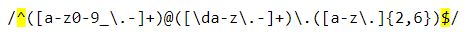
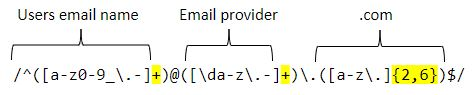
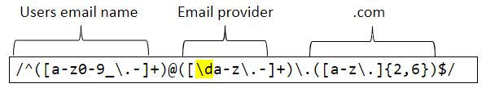
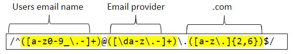
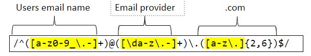

# Regex Tutorial - Email Matching

In this tutorial, I will explain how to match email addresses using the following expression: 
`/^([a-z0-9_\.-]+)@([\da-z\.-]+)\.([a-z\.]{2,6})$/`.

## Summary

A regular expression, or regex, is a set of characters that specify a pattern. Using a regex is mostly used to find patterns within a string, validation, or to find and replace characters. Below, we discuss the components of a regex and walk through how to apply it to matching email addresses. 

## Table of Contents

- [Anchors](#anchors)
- [Quantifiers](#quantifiers)
- [Character Classes](#character-classes)
- [Flags](#flags)
- [Grouping and Capturing](#grouping-and-capturing)
- [Bracket Expressions](#bracket-expressions)
- [Greedy and Lazy Match](#greedy-and-lazy-match)
- [Boundaries](#boundaries)
- [Back-references](#back-references)
- [Look-ahead and Look-behind](#look-ahead-and-look-behind)

## Regex Components

### Anchors 

If you want to search for a pattern that is at one end of the other, you use <em>anchors</em>. The anchors used here are <strong>"^"</strong> (the starting anchor) and <strong>"$"</strong> (the ending anchor). "^" is only an anchor if it exists in the beginning of an expression and "$" is only an anchor if it is at the end. For example, the expression "^E" will look for any line beginning with the capital letter "E". The expression "E$" looks for any line ending with the capital letter "E". On the other hand, the expressions "E^" or "$E" do not have an anchor as it does not follow the necessary order for anchored data. Using a backslash with escape the special characters should you need to match a "^" at the beginning of a line or a "$" at the end of a line.

### Quantifiers

Quantifiers indicate numbers of characters or expressions to match. In this example, we use the operator "+". This will connect the users name to the email provider, then to the ".com". We also use the quantifier "{2,6}", which will search for a length of 2-6 characters in the set of "[a-z\.]".

### Character Classes

Character classes lets us know what is being searched through the expression. For our example, we use "\d", or digit class. This corresponds with any <em>single</em> digit from 0-9. This express will capture "1", but not "11".

### Grouping and Capturing

You'll see from the preceding image that our expression given is grouped in three parts: User email name, Email provider, and .com. Groups are used to denote the the sets of data being searched. See below:
- Group 1: `([a-z0-9_\.-]+)`  = User email name
- Group 2: `([\da-z\.-]+)`  = Email provider
- Group 3: `([a-z\.]{2,6})` = .com, or extension

### Bracket Expressions

Bracket Expressions are used in grouping. From our example, you'll see the three groups all have brackets, "[]", with search criteria inside. Let's take a closer look at our groups to translate the data inside:
- Group 1: `([a-z0-9_\.-]+)`  = User email name
  - this bracket expression matches any lowercase letter a-z, any digit 0-9, any underscores, and any periods. Notice the "." is preceded by a "\". This is necessary so that the period captured <em>inside</em> the escape function. 

- Group 2: `([\da-z\.-]+)`  = Email provider
  - this bracket expression matches any single digit, any lowercase letter a-z, periods, and dashes.

- Group 3: `([a-z\.]{2,6})` = .com, or extension
  - this bracket expression matches any lowercase letter a-z and periods. The [quantifier](#quantifiers) "{2,6}" indicated the extension cannot be less than 2 and more than 6 characters long.

### Greedy and Lazy Match
By using "+" and "{}" we see that our example uses Greedy matches. The Greedy match is expressed by "+" because it will return as many matches as possible. The Lazy mode of quantifiers will return the least amount of times. We do not have a lazy quantifier in our example.

## Author

Emily comes from an oilfield and security administration background, serving 10 years in the industry. Recently, she decided to make a career change with the help of the UT Coding Bootcamp. For more info please visit her GitHub profile [here](https://github.com/Emilyrh1058).
